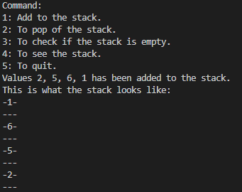
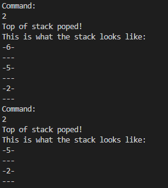
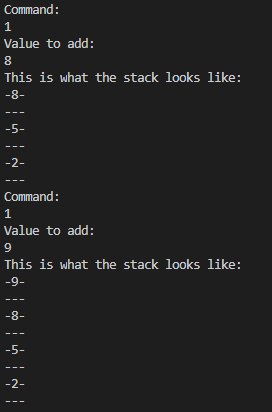

# Stack

This project is a simple implementation of a Stack data structure in Java. The Stack is a linear data structure which follows the Last-In-First-Out (LIFO) principle. The last element added is the first one to be removed.  
It consist of one class called Stack, it has method for add(push()), delete(pop()), check if empty(check()), and show the pile(show()). 

## Screenshots

We show the stack:

  
  
Then we use the pop() method twice:

   

Finnaly we use push() twice to add values on the top.
  
   

